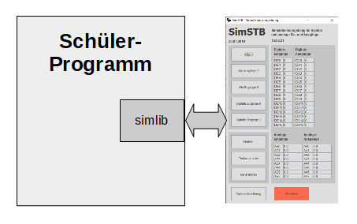
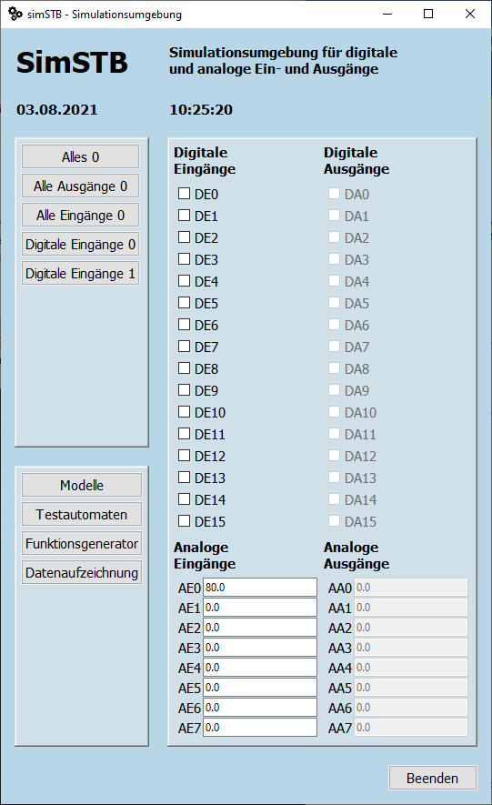

# SimSTB - Simulationsumgebung für digitale und analoge Ein- und Ausgänge 

Die Simulationsumgebung SimSTB ist für die Ausbildung im Bereich Python-Programmierung geeignet. Sie ist insbesondere für den Unterricht bei (elektro)technischen Schülern gedacht.

Oft muss ein Programm nicht nur über die Konsole oder eine graphische Oberfläche mit dem Benutzer kommunizieren, sondern auch über analoge und digitale Schnittstellen mit einem technischen System. Die Simulationsumgebung SimSTB erlaubt es, dies für Schulungszwecke auch ohne zusätzliche Hardware mittels Simulation durchzuführen.



Durch das Einbinden des Simulatorpakets `simstb` stehen dem Schüler vier einfach zu nutzende Funktionen für die digitale und analoge Ein- und Ausgabe zur Verfügung. Die analogen und digitalen Werte können über eine graphische Oberfläche bequem überwacht und gesetzt werden.

## Installation

1. Installieren Sie das Simulator-Paket mit dem Befehl `pip install simstb`
2. Prüfen Sie mit `pip list`, ob das Paket installiert wurde.
3. Prüfen Sie mit `simstb_cli --version`, ob das Kommandozeilenwerkzeug korrekt installiert wurde.
4. Bauen Sie mit `simstb_cli --init` die Laufzeitumgebung auf. Hierzu wird ein Ordner `sim` mit der Laufzeitumgebung im aktuellen Arbeitsverzeichnis angelegt. Achten Sie darauf, sich beim Aufruf im richtigen Verzeichnis zu befinden.
5. Kontrollieren Sie, ob folgende Verzeichnis-Struktur und Dateien vorhanden sind.

        ``` 
        sim
        ├── config.toml
        ├── CONTRIBUTING.md
        ├── data
        │   ├── anaaus.txt
        │   ├── anaein.txt
        │   ├── digaus.txt
        │   └── digein.txt
        ├── doc
        │   ├── beispiel.py
        │   ├── bilder
        │   │   ├── band_links.gif
        │   │   ├── band_rechts.gif
        │   │   ├── ...
        │   └── SimSTB-Benutzerdokumentation.pdf
        ├── LICENSE.txt
        ├── modelle.json
        └── README.md
        ```

6. Erstellen Sie eine Umgebungsvariable namens `SIMSTB_WURZEL`, welches auf das Simulationsverzeichnis `sim` zeigt.

## Benutzung

### 1. Simulations Steuerung und Monitor

Mit Hilfe des Programms `simstb_gui` können Sie die digitalen und analogen Ein- und Ausgänge überwachen und die Eingänge setzen. Die Werte werden im Sekundentakt aktualisiert. Starten können Sie die Simulator GUI in der Kommandozeile mit `simstb_gui` oder `simstb_cli --gui`.



### 2. Erstellung eigener Programme für die Simulationsumgebung SimSTB

Mit Hilfe der vier Funktionen:

- digEin
- digAus
- anaEin
- anaAus

können Sie eigene Python-Programme schreiben. Sie können deren Ausgaben mit der Simulationsumgebung überwachen und die Eingänge setzen.

Um die vier Funktionen zu nutzen, müssen Sie die Simulatorschnittstelle mit `import sim_schnittstelle.simulator as sim` importieren.

In der Datei __SimSTB-Benutzerdokumentation.pdf__ finden Sie eine ausführrliche Beschreibung. Ebenso finden Sie in der Dokumentation die Beispieldatei beispiel.py.

## Dokumentation

| Dokument                     | Inhalt                                                                                                                                                                                                                               |
| ---------------------------- | ------------------------------------------------------------------------------------------------------------------------------------------------------------------------------------------------------------------------------------ |
| README                       | Erster Überblick über das Projekt SimSTB; diese lesen Sie gerade                                                                                                                                                                     |
| SimSTB-Benutzerdokumentation | Benutzerdokumentation; beschreibt wie Sie die Simulationsumgebung installieren und benutzen; wenn Sie die Simulationsumgebung nur nutzen und keine eigenen Änderungen vornehmen wollen, das einzige Dokument, was Sie lesen sollten. |
| beispiel.py                  | Beispielprogramm für den Umgang mit der Simulatorschnittstelle.                                                                                                                                                                      |

## Version

Aktuelle Version: 1.0.0

## License

[MIT](LICENSE.txt) © [Markus Breuer].
